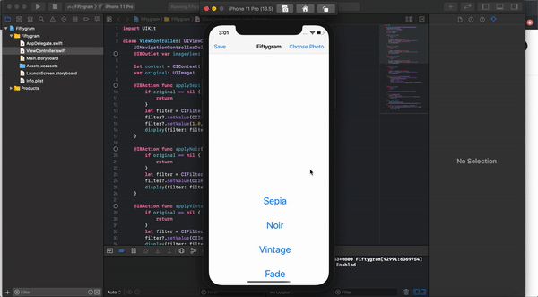

# Fiftygram

An app that allows users to apply filters to photos, more specifiacally: noir, fade, sepia, and vintage.

Visual demonstration:

## References
Apple Developer Documentation on Core Image Filter Reference:
https://developer.apple.com/library/archive/documentation/GraphicsImaging/Reference/CoreImageFilterReference/index.html
